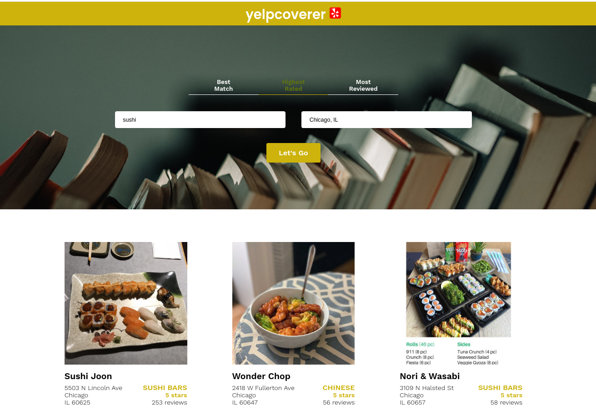

# yelpcoverer

[Live here](https://yelpcoverer.netlify.app/) for an **unknown period** of time.

Single page ReactJS web application, inspired by Yelp.com.

- Easily allows users to search, help connect people with great local businesses.
- It informs future customers of what they might expect and it keeps standards high.

## Stack used

- ReactJS
- YelpAPI

## Installation

add your own Yelp API KEY to the file `./util/Yelp.js`

```cs
npm i
npm start
```

## Author

IURII LYTVYN

## License

[MIT](https://choosealicense.com/licenses/mit/)

## Screenshot


